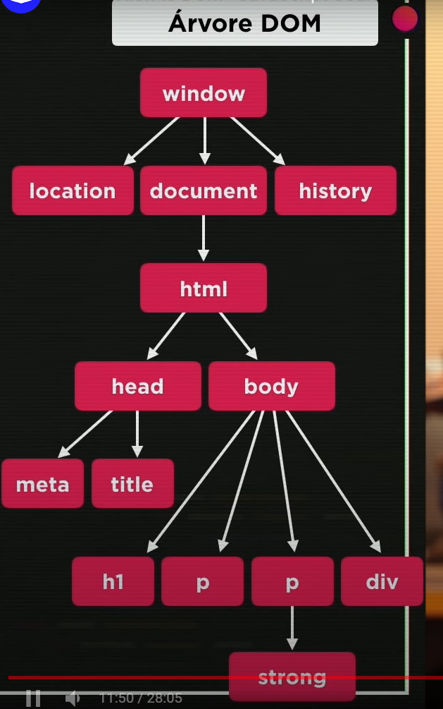

## DOM

DOM -> Document Object Model

Arvore DOM

            Window
location    document    history
                html
        head            body
    meta    tittle     h1   p    p      p
                                strong

(HTML é parent de Body e Child de Windows)

===
5 principais Metodos de acesso a elementos DOM dentro do JS
- Por Marca
getElementsByTagName
- por ID
getElementById
- Por Nome
getElementsByName
- Por Classe
getElementsByClassName
- Por Seletor
querySelector()
querySelectorAll()

[IMPORTANTE]
ID = #
CLASSE = .